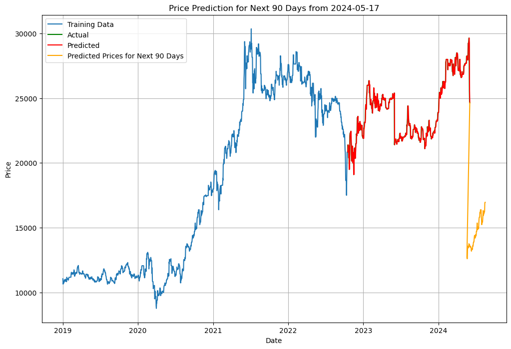
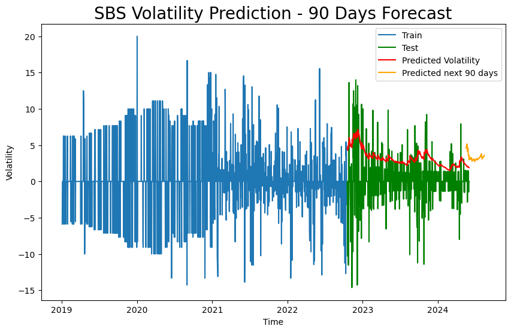

**Stock Price Prediction with ARIMA and GARCH**

---

This repository provides a framework for predicting stock prices of three banks: ACB, SBS, and CTS. Leveraging the ARIMA (AutoRegressive Integrated Moving Average) and GARCH (Generalized Autoregressive Conditional Heteroskedasticity) models, it offers accurate forecasts to assist in investment decisions.

### Dataset Description:
- The dataset comprises historical stock prices of ACB, SBS, and CTS banks.
- The primary predictor is the 'Price' column.

### Model Evaluation:
- The dataset is split into training and testing sets using three ratios: 6:4, 7:3, and 8:2.
- Model performance is evaluated based on various metrics after predictions.

### Forecasting:
- Predictions are made for 30, 60, and 90 days ahead.
- Visualizations and numerical results illustrate the forecasted stock prices.

### Repository Structure:
- **Data:** Contains datasets for ACB, SBS, and CTS banks.
- **Models:** Includes scripts for ARIMA and GARCH models.
- **Evaluation:** Consists of code for model evaluation and result visualization.
- **Examples:** Provides Jupyter notebooks demonstrating the prediction process.
- **Requirements.txt:** Lists required dependencies for easy setup.

### Results:

#### ARIMA Model Predictions for 90 Days:

- **CTS:**

- **ACB:**

- **SBS:**

#### GARCH Model Predictions for 90 Days:

- **CTS:**

- **ACB:**

- **SBS:**

### Conclusion:
This repository serves as a valuable resource for investors seeking reliable forecasts of bank stock prices. By leveraging ARIMA and GARCH models, it facilitates data-driven decision-making and enhances investment strategies.

--- 
